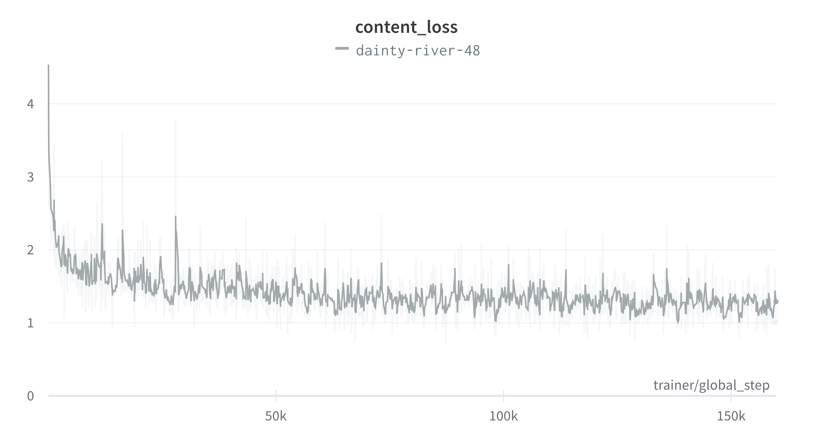
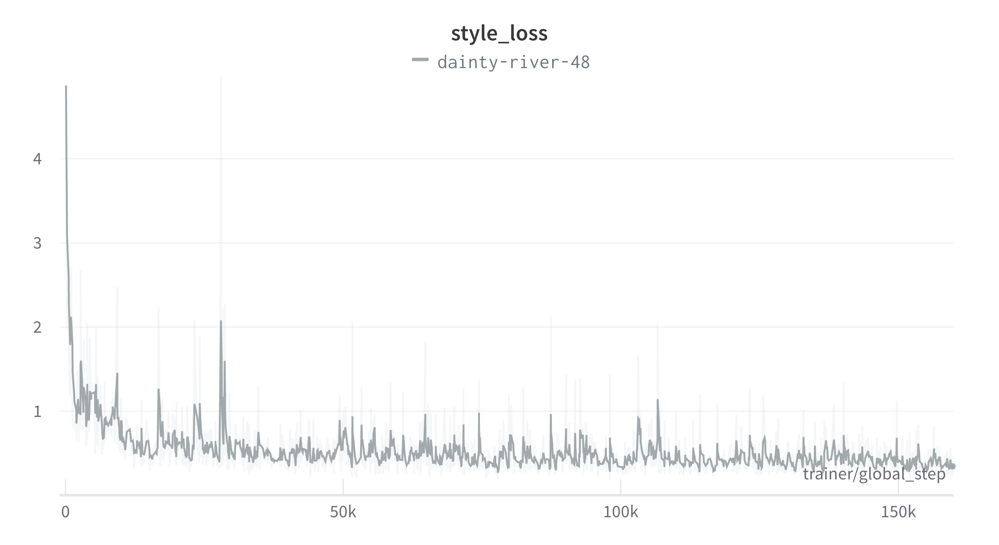
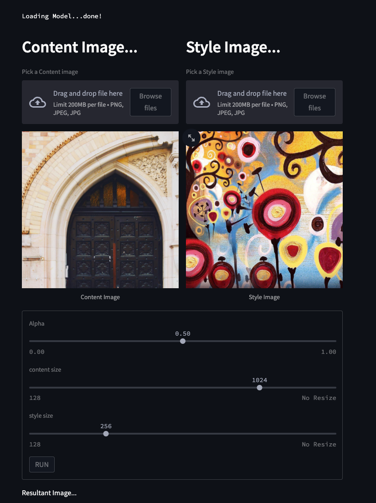
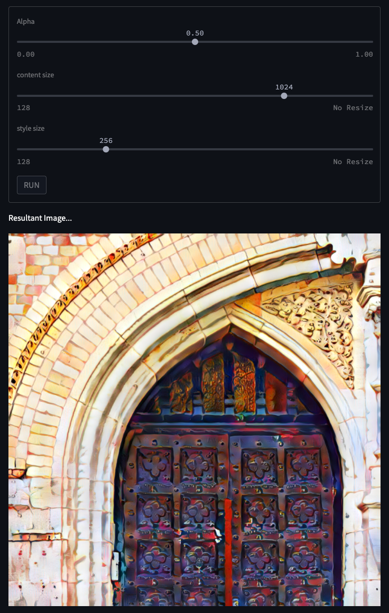

# Arbitrary Style Transfer in Real-time with Adaptive Instance Normalization

Unofficial pytorch-lightning implementation of a paper, "[Arbitrary Style Transfer in Real-time with Adaptive Instance Normalization](https://arxiv.org/pdf/1703.06868.pdf)" 


# Requirements
- torch==1.10.1
- torchvision==0.11.2
- pytorch-lightning==1.5.7
- tqdm==4.62.3
- wandb==0.12.10
- opencv-python-headless==4.5.5.62
- easydict==1.9
- onnxruntime==1.10.0

---

## Install requirements by pip
``` shell 
pip install -r requirements.txt 
```


## Install dependency by docker 
```shell
docker-compose up -d 
```

# Pretrained weights / models download

- **Encoder(VGG)** weights download by ["pytorch-AdaIN"](https://github.com/naoto0804/pytorch-AdaIN#download-models) repo 
- **Decoder** weights download by [link](https://drive.google.com/file/d/1tjKtRpvLV6_IywKpBjtj-7l_V9yhNfK-/view?usp=sharing)
- **Net Torchscript** model download by [link](https://drive.google.com/file/d/1aw9eJQisq04Gi7VANnlJeGBgqdcjNWRZ/view?usp=sharing)
- **Net onnx** model download by [link](https://drive.google.com/file/d/1HdrMmLoI7o469X_UXtJr6NKbMfd271ub/view?usp=sharing)

# Dataset 
- content : [COCO DATASET](http://images.cocodataset.org/zips/train2017.zip)
- style : [WikiArt](https://drive.google.com/u/0/uc?id=182-pFiKvXPB25DbTfAYjJ6gDE-ZCRXz0&export=download&confirm=t)

# Training

1. download dataset (content, style)
2. download Encoder weights and mv to weights dir 
3. check dataset path 
4. run script 

```bash 
python main.py \
--content_root_dir="{YOUR CONTENT DATASET PATH}" \
--style_root_dir="{YOUR STYLE DATASET PATH}" \
--num_workers=8 \
--batch_size=8 \
--log_every_n_steps=5 \
--gpus=1 \
--max_steps=16000
```


# Training result 


<details>
<summary> result plot, images </summary>

## loss plot




## sample images 


- [video](./src/video/training_sample.mp4)

</details>


# [APP](https://neural-style-transfer-76.herokuapp.com/)

Streamlit app source code referenced "[Neural-Style-Transfer-Streamlit
](https://github.com/kairavkkp/Neural-Style-Transfer-Streamlit)"





<details>
<summary> Menual </summary>


## 1. Download "Torchscript" model to "app/src" directory 

## 2. Install APP dependency by pip 

``` shell 
cd app
pip install -r requirements.txt 
```

- torch==1.10.1
- torchvision==0.11.2
- pytorch-lightning==1.5.7
- streamlit==1.7.0
- opencv-python-headless==4.5.5.62

## 2. Install AdaIN app by docker 


## 2.1. docker env
- MODEL_PATH : torchscript file path

## 2.2. Start container 

```shell
cd app
docker-compose up -d 
```


</details>


# References
- [Arbitrary Style Transfer in Real-time with Adaptive Instance Normalization](https://arxiv.org/pdf/1703.06868.pdf)
- [pytorch-AdaIN](https://github.com/naoto0804/pytorch-AdaIN#download-models) 
- [Neural-Style-Transfer-Streamlit
](https://github.com/kairavkkp/Neural-Style-Transfer-Streamlit)